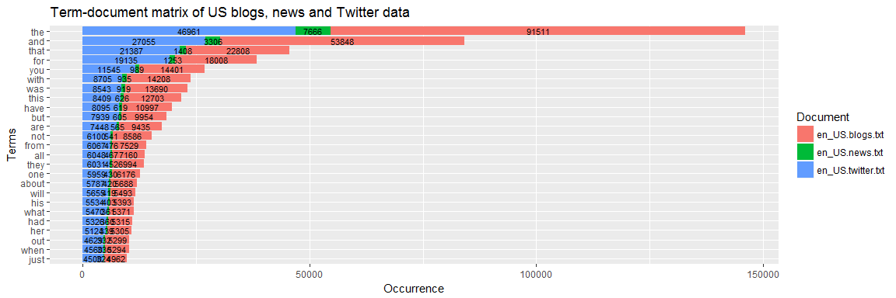

PhraseR Online Text Prediction App
========================================================
author: MLMV
date: June 2017
autosize: true
transition: fade

1. Introduction
========================================================

Around the world, people are spending an increasing amount of time on their mobile devices for email, social networking, banking and a whole range of other activities. But typing on mobile devices can be a serious pain. SwiftKey and other companies use statistical and machine learning techniques to build smart keyboards that make it easier for people to type on their mobile devices.

The PhraseR app demonstrates how these techniques work. It takes a large corpus of text documents to discover structures in the data and how words are put together. It performs cleaning and statistical analysis of the data, then builds a predictive text model, allowing users to type a sentence and get suggestions on the words they are most likely to use next.

2. Steps involved
========================================================

- <b> Defining the objectives: </b> Determining exactly what the outcome of this project should be.
- <b> Understanding the problem: </b> Investigating what data is available and which tools and techniques to use.
- <b> Data acquisition and cleaning: </b> Loading the data into R, sampling and tidying it for analysis and modeling.
- <b> Exploratory analysis: </b> A first analysis of the data, to understand structures, patterns and distributions of the data.
- <b> Statistical analysis and language processing: </b> Building n-grams, calculating probabilities and applying smoothing.
- <b> Building the predictive model: </b> Training the model, reading in a sentence and predicting the next word.
- <b> Building the app: </b> Extracting the key pieces of the scripts and data and bringing them together in a Shiny app.

3. Exploratory analysis
========================================================
In the exploratory analysis, insights were obtained into the structure and patterns of the data. Among other things, term-document matrices for unigrams, bigrams and trigrams were visualized to gain a first understanding of word frequencies and distributions.

A full version of the exploratory analysis report can be found at https://rpubs.com/mlmv/swiftkey.

4. Language processing and predictive modeling
========================================================

- Reading, storing, sampling, and cleaning of the data were done with the [tm package](https://cran.r-project.org/web/packages/tm/index.html). 
- [n-gram](https://en.wikipedia.org/wiki/N-gram) frequency tables up to n=6 and [maximum likelihood estimates](https://en.wikipedia.org/wiki/Maximum_likelihood_estimation) were created using [package text2vec](https://cran.r-project.org/web/packages/text2vec/index.html).
- [Good-Turing smoothing](https://en.wikipedia.org/wiki/Good%E2%80%93Turing_frequency_estimation) was applied via a custom built function inspired by the work of [Andreas Rubin-Schwarz](https://github.com/andirs) at Github.
- Two word prediction functions, with and without smoothing, using a [Katz-backoff model](https://en.wikipedia.org/wiki/Katz%27s_back-off_model) were custom built.
- Various timer and profiling functions were used to monitor and optimize runtimes of each component.
- All scripts and explanations can be found at https://github.com/MLMV/PhraseR

5. The PhraseR app
========================================================
left: 80%

- For optimum user experience, n-grams, estimates and probabilities were stored in .rds files. This produces predictions more quickly without having to wait for the app to  read and process all of the underlying data each time.
- Besides predicted words the PhraseR app also shows prediction time in seconds, and allows turning smoothing on or off. (if you're not sure there's a difference, try typing "i am going to")

To see it for yourself, go to https://mlmv.shinyapps.io/phraser/.

Have fun!

***

